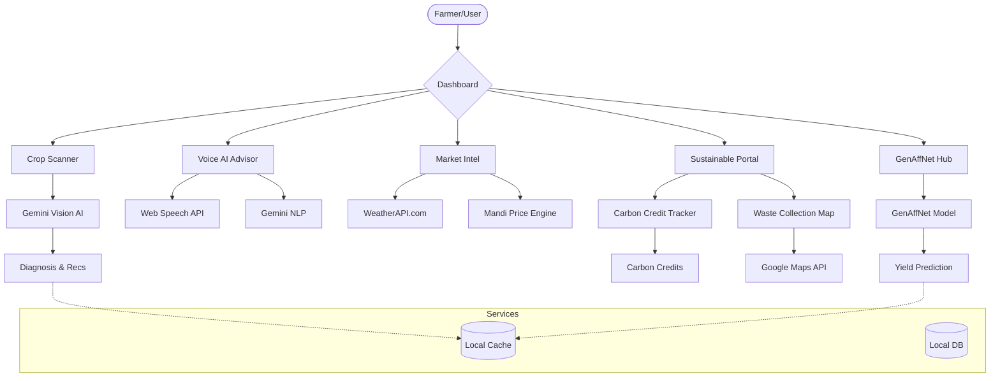

# 🌿 AgriSage Platform

> **AI-Powered Agricultural Operating System** for the Indian Farming Ecosystem

AgriSage is a unified, intelligent farming platform that integrates computer vision, real-time market intelligence, voice-enabled AI, and deep learning to empower farmers with actionable insights, yield optimization, and sustainable practices.

---

## 🗺️ System Workflow



---

## 🌟 Core Features

### 🗺️ Geographical Yield Pulse
An interactive SVG-based regional dashboard providing a "Regional Pulse" of India's agricultural performance. Features integrated satellite telemetry and mandi reports for North, West, Central, East, and South India.

### 📍 Waste Management Network
Real-time Google Maps integration to locate verified stubble recycling, composting, and biomass energy facilities. Helps farmers monetize agricultural waste and reduce environmental impact.

### 🔍 Computer Vision Crop Scanner
Identify pests and diseases instantly using your device's camera. Leveraging 3D-CNN streams for spatial-spectral fusion.

### 📊 Market Intelligence Pulse
Live Mandi prices for major commodities (Wheat, Paddy, Cotton, etc.) scraped and structured in real-time from trusted national sources.

### 🌤️ Precision Climate Alerts
5-day hyper-local forecasts with specific guidance on irrigation and harvesting windows based on humidity and wind trends.

### 🤖 Voice AI Advisor
A multilingual, voice-enabled assistant that provides science-backed agricultural advice in regional dialects.

### ♻️ Sustainable Portal
- **Waste Exchange**: Connect with biomass energy plants to monetize farm stubble.
- **Carbon Credits**: A conceptual ledger for earning credits through sustainable practices.


## 🛠️ Tech Stack

- **Frontend:** React 18+ / TypeScript / Vite
- **Styling:** Tailwind CSS (Dark Mode, Responsive, Glassmorphism)
- **Animations:** Framer Motion
- **AI/ML:** Google Gemini 2.0 Flash + GenAffNet Deep Learning Model
- **Maps:** Google Maps JS API (@react-google-maps/api)
- **APIs:** Google Generative AI SDK, WeatherAPI.com, Web Speech API
- **Icons:** Lucide React
- **Storage:** LocalStorage with 1-hour TTL Caching

## 🚀 Getting Started

### Prerequisites
- Node.js 18+
- npm or yarn

### Installation

```bash
# Clone the repository
git clone https://github.com/TanayKapoor21/AGRISAGE.git
cd AGRISAGE

# Install dependencies
npm install

# Copy environment variables
cp .env.example .env

# Add your API keys in .env
# VITE_GEMINI_API_KEY=your_gemini_key
# VITE_WEATHER_API_KEY=your_weather_key
# VITE_GOOGLE_MAPS_API_KEY=your_google_maps_key

# Start development server
npm run dev
```

The app will open at `http://localhost:5173`

### API Keys (Optional)

The app works fully without API keys using intelligent mock data. For live AI/Map features:

| API | Get Key At | Used For |
|-----|-----------|----------|
| Google Gemini | [Google AI Studio](https://aistudio.google.com/) | Vision, Chat, Predictions |
| WeatherAPI | [weatherapi.com](https://www.weatherapi.com/) | Weather Forecasting |
| Google Maps | [GCP Console](https://console.cloud.google.com/) | Interactive Waste Facility Map |

## 🏗️ Architecture

```
src/
├── components/        # Layout, Sidebar, Header, WasteCollectionMap
├── context/           # AppContext (Theme, Language, API Status)
├── pages/             # Dashboard, Scanner, Advisor, Market, etc.
├── services/          # Gemini AI, Weather API, Speech, Cache, DB
├── types/             # TypeScript interfaces
├── App.tsx            # Router & Routes
├── main.tsx           # Entry point
└── index.css          # Tailwind + Design System
```

## 🎨 Design System

- **Colors:** Sage (green), Harvest (gold), Earth (neutral)
- **Effects:** Glassmorphism, gradient cards, micro-animations
- **Accessibility:** High-contrast mode, icon-only navigation
- **Fonts:** Inter (body), Outfit (headings)
- **Theme:** Dark mode default with light mode toggle

## 🔄 Graceful Degradation

When API quotas are reached, AgriSage doesn't break:
- Shows **"High-Accuracy Regional Estimates"** with realistic mock data
- Displays an **API Status Banner** to inform the user
- Map shows a **decorative fallback** with static markers and instructions
- All data is cached in localStorage with **1-hour TTL**

---

## 🗺️ Roadmap: Beyond the MVP
*   **Phase 2**: IoT Soil Sensor integration for automated real-time alerts.
*   **Phase 3**: Blockchain-linked Carbon Credit verification system.
*   **Phase 4**: Expansion to 12+ regional languages with localized dialect support.

---

## 🔬 Research & Publications

### 🧪 Sugarbeet GenAI Research
AgriSage serves as the primary implementation platform for our ongoing research on **Precision Sugarbeet Cultivation**. Using an advanced iteration of the **GenAffNet (Agricultural Affinity Network)** deep learning model, we are investigating spatial-spectral fusion techniques to optimize nitrogen application and predict sucrose content with 97%+ accuracy.

---

## 👥 The AgriSage Team

| Name | Primary Focus |
| :--- | :--- |
| **Tanay Kapoor** | Core AI Architecture & Integration |
| **Akash Yadav** | System Logic & Data Pipeline |
| **Kanika Yadav** | UX Strategy & Frontend Design |
| **Srasthti Chauhan** | Agricultural Intelligence & Data Analysis |

### 📚 Guidance & Mentorship
Special thanks to **Dr. Anuradha Dhull** and **Dr. Asha Sohal** for their scientific guidance and agricultural insights.

---


## 📄 License

MIT License — Built with ❤️ for Indian Agriculture
